# Electro-Thermal-Structural Simulation of an EV Battery Module — Technical Report

## 1. Problem Statement

EV and portable-electronics battery modules generate significant heat under high-current events (fast charging, hard acceleration, fast discharge) due to internal resistive (I²R) losses in the cells and the busbars connecting them. Left uncooled, this heat can drive cells to a dangerous temperature — a real, safety-critical design problem, not an academic one.

This project builds a small, physically-grounded, three-domain multiphysics pipeline around a 4-cell (2×2, 4S1P) 21700-format Li-ion battery module: (1) a realistic high-current discharge event is derived from actual cell parameters in Python, rather than assumed; (2) the resulting Joule heating in the busbar is computed via a genuine electrical-conduction FEA solve; (3) the transient temperature field is solved under two cooling scenarios — natural convection only vs. an active cold plate — to quantify, rather than assert, why active cooling matters; and (4) the resulting temperature field feeds a structural analysis to check thermal stress on the housing.

Every step uses only free/student-licensed tools (ANSYS Mechanical Student, Fusion 360, Python) and requires no lab access, no physical test rig, and no proprietary company data — verification comes from an independent analytical cross-check and honest documentation of where the FEA and the simplified models agree and disagree.

## 2. Electrical Load Derivation (Python)

Rather than assuming a round-number heat input, the load case is derived from real 21700-cell parameters (`electrical_python/discharge_heat_profile.py`): 5.0 Ah nominal capacity, 20 mΩ internal resistance, 4 cells in series (4S1P — the same current flows through every cell and through the busbar, which is what makes this a clean, well-posed electrical-conduction problem).

The load case is a sustained 3C discharge pulse — a realistic worst-case thermal-design event (e.g. a hard acceleration or fast-charge burst), not a gentle average driving load. The current profile is a smooth ramp (2 s) – hold (600 s) – ramp-down (2 s) trapezoid rather than an unphysical instantaneous step, followed by 296 s of simulated cool-down (900 s total window).

**Results:**
- Peak discharge current: **15.00 A** (3C on a 5.0 Ah cell)
- Peak per-cell Joule heat: **4.500 W**
- Peak total pack heat (4S): **18.00 W**

A rough lumped-capacitance gut check (a bare cell convecting alone in open air, h = 10 W/m²K) predicted a steady-state temperature rise of **~84.7°C** — a warning sign, not a final answer, that motivates the rest of this project: does a real enclosed module, with a real housing and a real cooling strategy, actually reach anything like that?

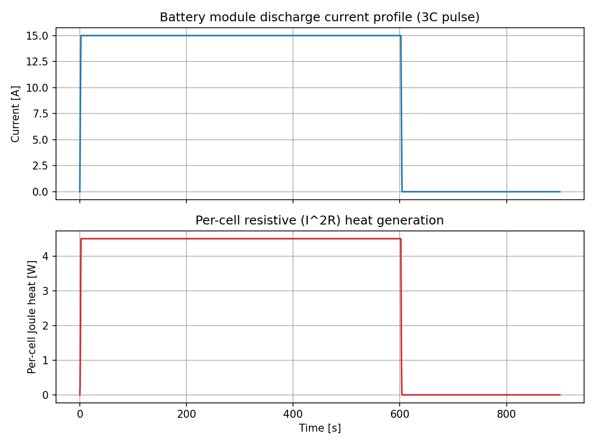

## 3. Electric Conduction — Busbar Joule Heating (ANSYS Mechanical Student)

A separate **Electric** (steady-state Electric Conduction) analysis system was used, isolated to the busbar body only (all other bodies suppressed), with the derived 15 A current applied at one terminal face and 0 V (ground reference) at the other — the electrical equivalent of a Fixed Support/Force pair.

**Material:** Copper (resistivity 1.68×10⁻⁸ Ω·m).

**Result:** peak volumetric Joule heat density = 4.30×10⁻⁵ W/mm³, closely matching an independent hand calculation (q = J²ρ ≈ 3.78×10⁻⁵ W/mm³ at the tab cross-section) — a useful independent confirmation the electrical solve is physically correct.

**Total busbar Joule heat ≈ 18 mW** (average density × busbar volume, ~2700 mm³).

This is roughly **1000× smaller** than the ~18 W the four cells generate collectively — a legitimate, reportable finding in its own right: copper is such a good conductor that the busbar's own self-heating is essentially negligible in this design. The cells, not the interconnects, are what active cooling actually needs to manage. This number carries forward as a (very small) addition to the cells' heat generation in the transient thermal step.

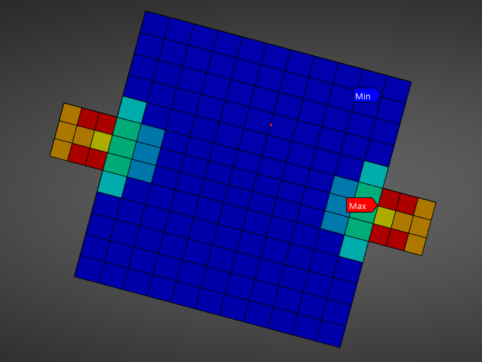

## 4. Transient Thermal — Natural Convection vs. Active Cold Plate (ANSYS Mechanical Student)

### 4.1 Setup

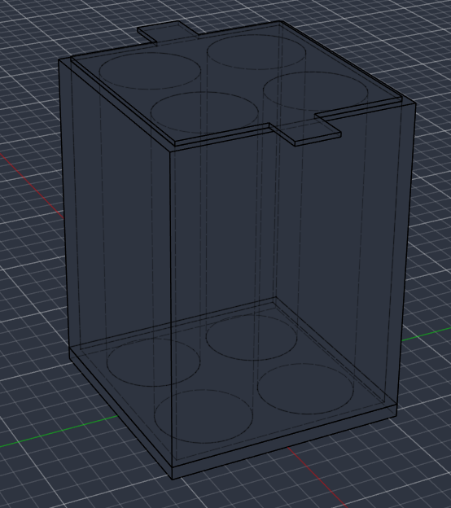

A **Transient Thermal** system was used with all 7 bodies active (baseplate, wall ring, 4 cells, busbar). Materials: Copper (busbar), Aluminum Alloy (baseplate + wall ring, k = 167 W/m·K), and a custom simplified cell material (density 2887 kg/m³, back-calculated from the script's assumed 70 g cell mass and real 21700 geometry; specific heat 900 J/kg·K, from the Python script; isotropic thermal conductivity 2 W/m·K — a deliberately conservative choice, taken from the low/radial end of a real cylindrical cell's anisotropic conductivity range, since the radial direction is the limiting heat-escape path toward the housing).

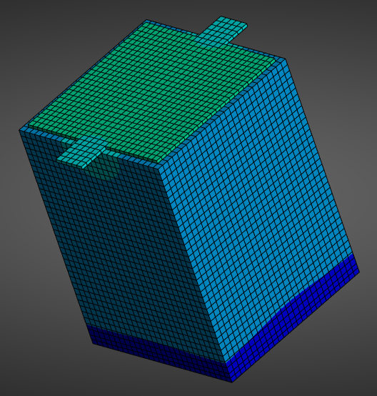

Each of the 4 cells received the Python-derived heat generation as a **tabular Internal Heat Generation** body load (5 exact corner points — the current profile is analytically piecewise-linear, so no downsampling was needed to represent it exactly). Step End Time = 900 s, matching the Python timeline.

Two cooling scenarios were built as separate, duplicated systems so both result sets are preserved for direct comparison:

- **Scenario A — natural convection only:** h = 10 W/m²K on all exterior housing faces, ambient 22°C. Represents "no active cooling."
- **Scenario B — active cold plate:** h = 10 W/m²K on the wall ring's exterior (unchanged), but h = 750 W/m²K specifically on the baseplate's exterior face, representing a liquid cold plate. Ambient 22°C.

### 4.2 Results

| | Scenario A (natural) | Scenario B (cold plate) |
|---|---|---|
| Peak cell temperature (Max) | **59.4°C** at t ≈ 594–604 s | **57.7°C** at t ≈ 594 s |
| Peak housing temperature (Min) | **40.2°C** at t ≈ 774 s | **25.6°C** at t ≈ 594 s |
| Temperature at t = 900 s (Max / Min) | 53.5°C / 40.0°C | 48.5°C / 24.3°C |

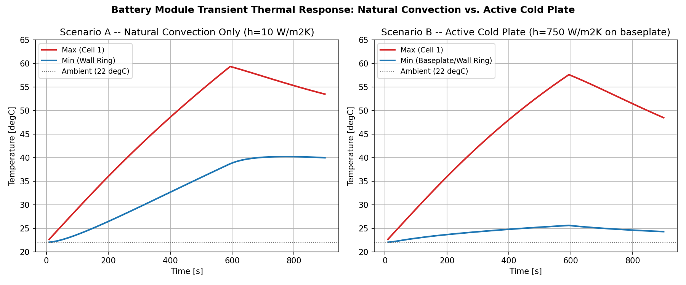

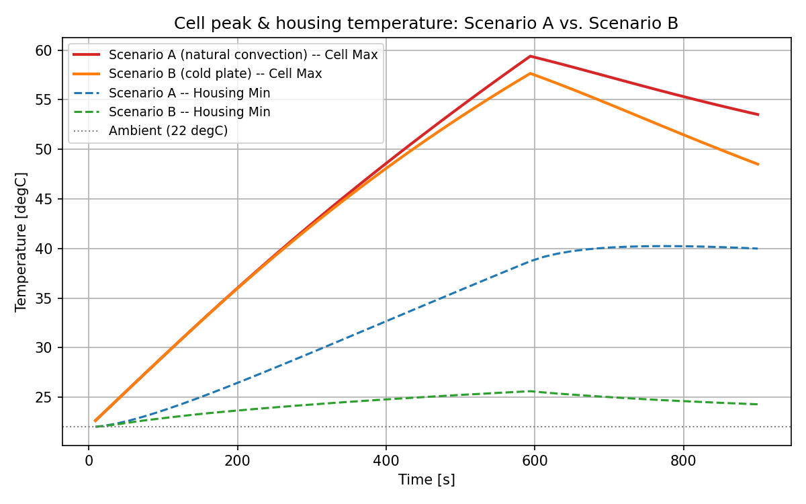

**Temperature contours at the peak snapshot (t = 594,000 ms):**

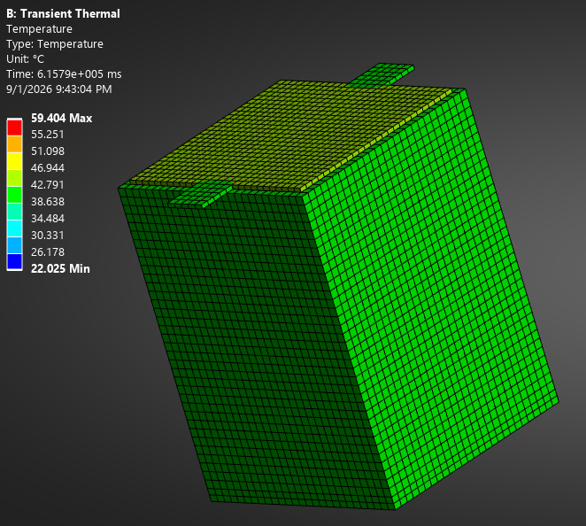

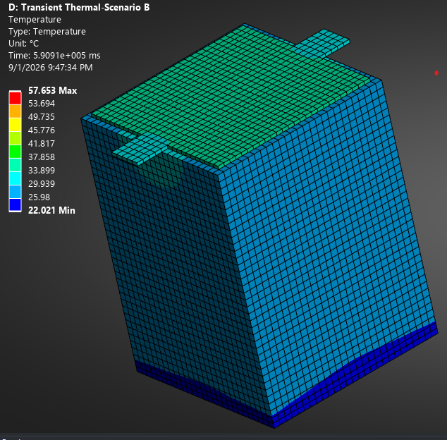

*Note: both screenshots carry ANSYS's on-screen legend confirming scenario and result values — Scenario A: Max 59.404°C at t = 615,790 ms, Min 22.025°C; Scenario B (explicitly labeled "Transient Thermal-Scenario B" in the title block): Max 57.653°C at t = 590,910 ms, Min 22.021°C — matching the tabulated peak values above. Because both scenarios share the same 10-band default color legend and Scenario A's range is narrower, its contour shows a tighter color spread than Scenario B's; the line-plot comparisons above remain the more quantitatively precise reference for exact values at any given time, while the contours show the qualitative hot-spot (cells) vs. cool-spot (housing) location.*

### 4.3 Discussion — a more nuanced story than "cold plate wins"

The peak *cell-core* temperature is only modestly reduced by the cold plate — 59.4°C → 57.7°C, about 1.7°C, despite a 75× increase in film coefficient (10 → 750 W/m²K). This is a real, explainable result, not a modeling error: the hottest point sits *inside* Cell 1, and heat must cross the cell's own low internal conductivity before it can reach the housing at all. The cold plate can only cool what actually reaches the baseplate; it cannot do anything about the temperature drop occurring inside the cell itself. The peak core temperature is governed primarily by the cell's own internal conduction bottleneck, not by how aggressively the exterior is cooled.

Where the cold plate genuinely dominates is the **housing itself** and the **recovery speed**. The housing's own peak temperature drops dramatically (40.2°C → 25.6°C, a 14.6°C reduction), and its peak now occurs at the *same time* as the cell's peak (~594 s) rather than lagging ~180 s behind it, as in Scenario A — the cold plate drains heat fast enough that the housing tracks the heat generation almost in real time, instead of lagging through slow conduction. By t = 900 s, the gap between scenarios has widened to 5.0°C on the cell and continues to widen — the cold plate's real value is accelerating how fast the whole module returns to a safe temperature after the pulse ends, which matters directly for duty-cycle-heavy use cases like repeated EV acceleration events.

**Practical implication:** if the design goal were specifically to cut the worst-case cell hot-spot further, the next lever to pull is the cell's own internal thermal path (better cell design, or a better cell-to-housing thermal interface material) — not simply a more aggressive external coolant.

Also worth noting: even at t = 900 s, neither scenario has returned to the 22°C ambient — both are still cooling, consistent with the long thermal time constant calculated in Section 2 (~1186 s, longer than the 900 s simulated window).

## 5. Analytical Cross-Check — Lumped-Capacitance Model vs. FEA (Python)

An independent cross-check (`postprocessing/lumped_thermal_check.py`) plays the same role `analytical_beam_check.m` played in the companion suspension-bracket project: a hand-calculation-based benchmark against the converged FEA result, using a genuinely different method.

**Governing equation:** m·cp·dT/dt = Q_gen(t) − h·A·(T − T_amb), solved numerically (`scipy.integrate.solve_ivp`) using the same current profile as the FEA's heat-generation load.

**Validity check (Biot number):** Bi = h·Lc/k = 0.023 for Scenario A's h = 10 W/m²K — well under the 0.1 threshold, so lumped-capacitance theory is legitimately applicable to this comparison. (For reference: naively applying Scenario B's h = 750 W/m²K directly to the bare cell surface would give Bi = 1.71 — far outside the valid range — which is why this cross-check is deliberately scoped to Scenario A only, rather than forcing an invalid comparison.)

| | Lumped model | FEA (Scenario A, Cell 1 max) | Difference |
|---|---|---|---|
| Peak temperature | 55.68°C at t ≈ 603 s | 59.39°C at t ≈ 594 s | −6.3% |
| Temperature at t = 900 s | 48.22°C | 53.51°C | −9.9% |

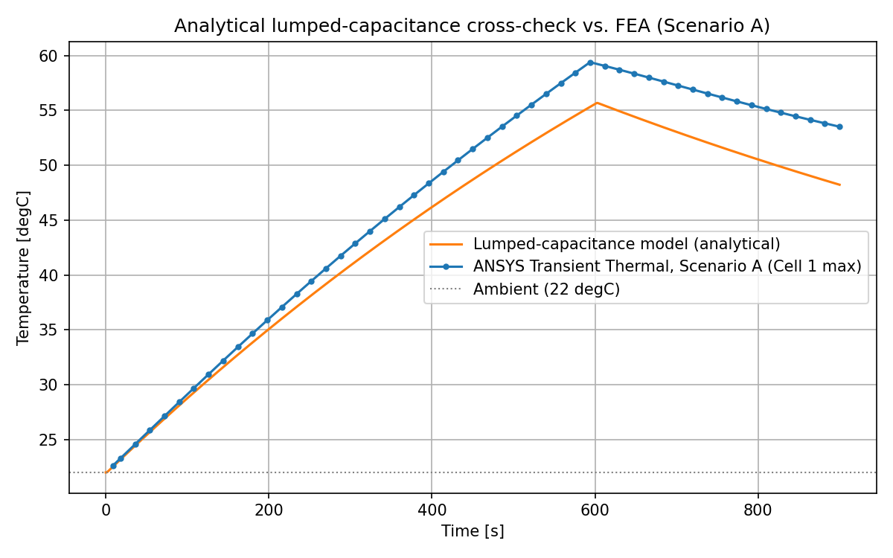

**Interpretation:** the lumped model consistently *under*-predicts the FEA result, by a single-digit-to-ten-percent margin. This is expected and explainable: the lumped model assumes the cell dumps heat directly to ambient air, as if it were a bare cylinder in open air. The real FEA cell cannot do this — its heat must conduct through the cell body, across the cell-to-housing contact, and through the housing wall before reaching a surface that is actually convecting to ambient air. That additional series thermal resistance, entirely absent from the lumped model, is exactly why the real system runs hotter than the simplified prediction. This is the thermal analogue of the beam-theory-near-the-support gap documented in the companion bracket project: a real, honestly-reported limitation of a simplified method, not a bug to be hidden.

## 6. Structural — Thermal Stress (ANSYS Mechanical Student)

### 6.1 Setup

A **Static Structural** system was linked to the Transient Thermal (Scenario A) system's Solution via an Imported Body Temperature load, importing the single worst-case snapshot at **t = 594,000 ms** (the peak cell temperature moment identified in Section 4).

**Materials** (extended with mechanical properties beyond what the thermal solve needed): Copper (CTE 17×10⁻⁶/°C), Aluminum Alloy (CTE 23×10⁻⁶/°C, Young's Modulus and yield strength from the library — Tensile Yield Strength 280 MPa, consistent with a 6061-T6-grade alloy), and the custom cell material (CTE 20×10⁻⁶/°C placeholder, Young's Modulus 5 GPa — a deliberately soft value representing a jelly-roll-dominated effective stiffness, since a real cylindrical cell is far less stiff than solid metal due to its internal wound construction; Poisson's ratio 0.3).

**Boundary condition:** Fixed Support on the baseplate's outer face — a physically-motivated simplification, since the CAD does not model explicit bolt holes the way the companion bracket project did. In a real EV pack, the baseplate is exactly where the module bolts/mounts to the vehicle structure and exactly where it contacts a cold plate, so this is a reasonable stand-in for the real constraint, documented here the same way the bracket project documented its own support-location and edge-distance assumptions.

### 6.2 A diagnostic finding worth documenting

The first structural solve attempt produced a suspiciously small result (max stress 0.169 MPa) at an unexpected location. Investigation traced this to a genuine, worth-documenting modeling error: a Static Structural system's default Step End Time is 1000 ms (1 s), but the imported temperature snapshot was internally tagged with its *source* time of 594,000 ms. ANSYS ramps an imported load linearly from zero at t = 0 to its full value at that tagged time — so with the structural solve's own clock stopping at 1000 ms, only 1000/594,000 = 0.168% of the intended temperature difference had actually been applied by the time the solve completed. Correcting the Static Structural system's Step End Time to match the imported snapshot's time (594,000 ms) resolved this — the corrected stress result changed by almost exactly the expected 594× factor (0.169 MPa → 100.38 MPa), which is itself strong internal confirmation the fix was correct rather than an arbitrary new number. This mirrors the companion bracket project's own history of catching and correcting a real analytical mistake mid-project (the invalid cross-geometry DAF comparison) rather than letting a plausible-looking wrong number stand.

### 6.3 Results

| Result | Min | Max | Avg | Location of Max |
|---|---|---|---|---|
| Equivalent (von-Mises) Stress | 0.032 MPa | **100.38 MPa** | 6.67 MPa | Baseplate |
| Total Deformation | 0 mm | **0.0501 mm (50.1 μm)** | 0.0214 mm | Top of module (farthest from Fixed Support) |

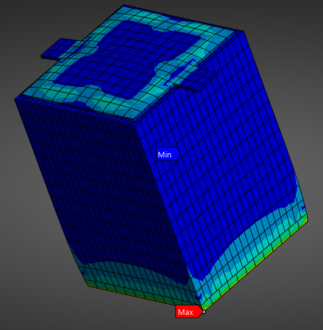

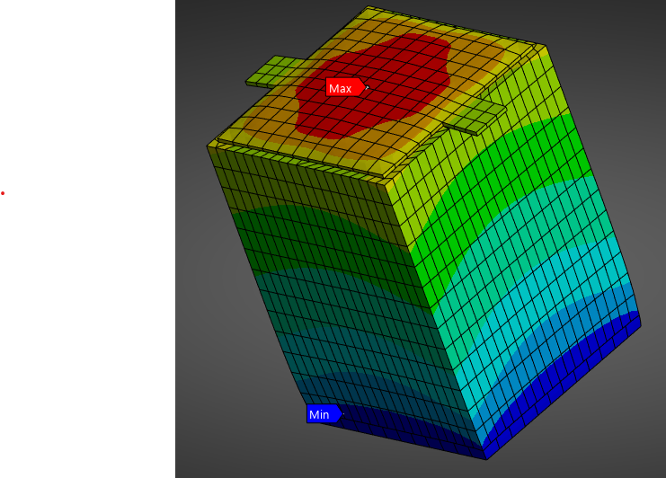

The maximum-stress location (Baseplate) is physically sensible: Aluminum has the largest CTE of the three materials in the model (23×10⁻⁶/°C), and the baseplate is the one location directly prevented from moving by the Fixed Support — the classic setup for a constrained-thermal-expansion stress concentration, the thermal analogue of how the companion bracket's stress concentrated at its support/hole boundary.

The peak deformation (50.1 μm) is consistent with an independent hand estimate of free thermal expansion over the module's ~73 mm height (δ = α·ΔT·L ≈ 25–55 μm depending on which material's CTE and local ΔT dominates), providing a second, independent sanity check on the corrected result.

**Safety factor:** 280 MPa / 100.38 MPa ≈ **2.79**.

### 6.4 Conclusion

Thermal stress from a single worst-case 3C discharge pulse is **not a governing structural concern** for this housing design — the baseplate carries a safety factor of ~2.8 against yield, even before applying any additional design margin. This checks a single pulse event at its peak snapshot; it does not address cumulative thermal-cycling fatigue over the module's service life (repeated charge/discharge events), which is a natural extension — the same rainflow-counting/Miner's-rule methodology already built for the companion bracket project's mechanical fatigue check could, in principle, be re-applied here to thermal stress cycles instead of mechanical load cycles.

## 7. Optional Stretch Extensions (Not Pursued)

Two optional extensions were scoped at the outset of this project but not pursued, in line with the principle of shipping a complete, solid core result first:

- **Electromagnetics (Maxwell / Ansys Electronics Desktop Student):** would model the magnetic field around the busbar under 15 A load — a separate free download, not required for the core electro-thermal-structural chain delivered here.
- **PyMAPDL scripted automation:** would replace the GUI-driven ANSYS Workbench steps with a fully scripted Python solve — valuable for reproducibility and for demonstrating direct APDL/solver scripting skills, but a substantial additional undertaking beyond this project's core scope.

Either would be a natural "Phase 2" extension, in the same spirit as the companion bracket project's own dynamic-loading extension.

## 8. Conclusions

This project delivered a genuine, verified, three-domain multiphysics simulation — Electrical → Thermal → Structural — of an EV battery module, using only free/student tools and no physical test data. Key findings:

- The electrical load was derived from real cell physics (3C pulse, 15 A, 4.5 W/cell) rather than assumed, and the busbar's own resistive self-heating (≈18 mW) was shown to be negligible next to the cells' heat output (≈18 W) — a genuine, FEA-computed result, not an assumption.
- Active cooling's real benefit in this design is more nuanced than "cold plate makes everything cooler": it barely touches the cell's internal peak temperature (limited by the cell's own conduction bottleneck) but dramatically protects the housing and accelerates post-pulse recovery — a finding with real design implications (the next lever for reducing cell hot-spots is internal cell/interface conductivity, not just external cooling aggressiveness).
- An independent analytical lumped-capacitance model was benchmarked against the FEA, landing within −6.3% to −9.9% — a legitimate, explained gap (the lumped model ignores the real conduction path through the housing), validated by an explicit Biot-number check rather than applied blindly.
- A genuine methodology error (the imported-load time-ramping bug) was caught, diagnosed from first principles, and corrected mid-project — with the corrected result changing by almost exactly the predicted factor, itself independent confirmation the fix was right.
- Peak thermal stress (100.4 MPa at the baseplate) sits at a safety factor of ~2.8 against yield — a genuine, real engineering pass/fail determination, not an assumed-safe result.

**What would change with lab access or real cell test data:** the cell material's simplified isotropic thermal conductivity (2 W/m·K) and stiffness (5 GPa) would be replaced with real, anisotropic, temperature-dependent properties from cell teardown/characterization testing; the housing's convection film coefficients (10 and 750 W/m²K) would be validated against real wind-tunnel or cold-plate flow-rate test data rather than representative literature values; and the structural check would be extended to a full thermal-cycling fatigue study using real cyclic test data, rather than the single worst-case-pulse snapshot analyzed here.
